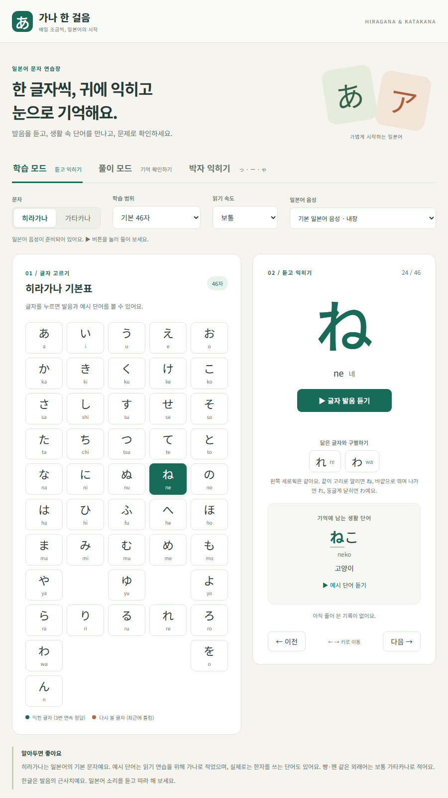

# 가나 한 걸음

히라가나·가타카나를 발음과 생활 단어로 익히는 브라우저용 학습 프로그램입니다. 설치 없이 `index.html`을 Edge나 Chrome에서 열면 됩니다.

**바로 사용하기:** https://cucube1985.github.io/kana-hangeoreum/ — 홈 화면에 앱으로 설치할 수 있고, 한 번 열면 오프라인에서도 동작합니다.

- 학습 모드: 오십음도, 가타카나 확장음(ファ·ティ 등), 발음 듣기, 필순 애니메이션과 따라 쓰기, 예시 단어, 닮은 글자 비교, 글자별 기록 표시
- 풀이 모드: 읽는 법 고르기(소리 없이 풀기 지원), 듣고 문자 고르기, 단어 빈칸 채우기, 닮은 글자 구별, 히라·가타 짝 맞추기, 직접 입력하기(로마자·한글) (약한 글자 우선 출제)
- 박자 익히기: 촉음 っ, 장음, ー, 작은 ゃ·ゅ·ょ를 짝지은 단어로 듣고 구별
- 그 밖에: 기록 내보내기·가져오기(기기 간 이동), 다크 모드, 앱 설치·오프라인 사용

자세한 사용법은 [사용안내.md](사용안내.md)를 보세요.

## 제작 도구

- `node verify.js` — 음성 누락, 보기 중복, 닮은 글자·박자 데이터 검사
- `python build-strokes.py` — KanjiVG에서 가나 SVG를 받아 `stroke-data.js`(필순 데이터)를 만듭니다.
- `sw.js` — 오프라인용 서비스 워커. 배포할 때 고칠 필요가 없습니다. 앱 파일은 온라인이면 매번 최신본을 확인해 저장하고, 음성은 `audio-map.js`와 비교해 새 파일만 받습니다.

### 배포 규칙

1. 음성 파일은 번호를 바꾸거나 덮어쓰지 않습니다. 새 문장은 `audio-texts.json` 끝에 추가해 새 번호로 만듭니다(`generate-audio.py`가 이렇게 동작합니다). 같은 번호의 파일을 바꾸면 이미 저장한 기기에는 반영되지 않습니다.
2. `index.html`에 새 파일(스크립트, 스타일, 아이콘)을 연결하면 `sw.js`의 `CORE` 목록에도 추가합니다. 빠뜨리면 `node verify.js`가 알려 줍니다.
3. 배포 전에 `node verify.js`를 실행합니다.
- `python generate-audio.py` — `audio-texts.json`의 문장으로 `audio/` 음성과 `audio-map.js` 생성 (edge-tts 필요, 이미 있는 파일은 건너뜀). 새 단어는 목록 끝에 추가하세요.

## 라이선스와 출처

- 필순 데이터 `stroke-data.js`는 [KanjiVG](https://kanjivg.tagaini.net)(Copyright © Ulrich Apel)에서 만들었으며 [CC BY-SA 3.0](https://creativecommons.org/licenses/by-sa/3.0/)을 따릅니다. 이 파일을 고쳐 배포할 때도 같은 라이선스를 적용해 주세요.
- 내장 음성은 Microsoft Edge 음성 합성(ja-JP-NanamiNeural)으로 만들었습니다.
